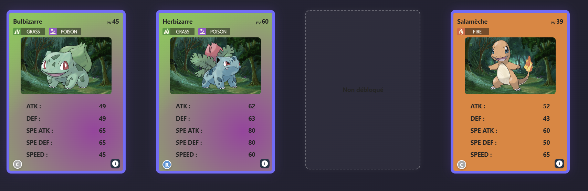

# 🌐 Pokédex Frontend – Projet React + Vite

Une interface web complète et dynamique en React pour interagir avec l'API Pokédex.  
Authentification JWT, boosters, animations GSAP, différenciation admin/user, et rendu PWA 💥

---

# 🌐 Pokédex Frontend – Projet React + Vite

Déployé sur AWS 🚀

- 🌍 **Frontend (React + Vite)** : via **AWS S3** + **CloudFront**
- ⚙️ **Backend (Node.js + MongoDB)** : hébergé sur une instance **EC2**
- 📁 **URL de production** : [
  `http://pokedex-starter-paulfrtn.s3-website-us-east-1.amazonaws.com/`](http://pokedex-starter-paulfrtn.s3-website-us-east-1.amazonaws.com/)

### 👥 Utilisateurs par défaut

| Rôle  | Email             | Mot de passe |
|-------|-------------------|--------------|
| admin | admin@poke.com    | admin123     |
| user  | aldous@huxley.com | password     |

---

## 🚀 Cloner le projet

```bash
git clone git@github.com:zkerkeb-class/pokedex-starter-paulfrtn.git
cd pokedex-front-paulfrtn
```

---

## ⚙️ Configuration de l'environnement

Clonez le fichier `.env.example` pour créer votre fichier `.env` :

```bash
cp .env.example .env
```

Ensuite, modifiez la variable VITE_API_URL dans .env pour qu'elle pointe vers l'URL de votre backend (par exemple l'IP
publique de votre EC2) :

```
VITE_API_URL=http://<votre-ip>:3000
```

---

## 📦 Installer les dépendances

```bash
npm install
```

---

## 🧠 Fonctionnalités de base

### 📋 Pokémons

- Affichage de **tous les Pokémons**
- **Recherche par nom** (french ou english)
- **Filtrage par types** (jusqu'à 2 simultanés)
- Combinaison de **recherche + filtres**

### 🔐 Authentification

- **Connexion / Inscription** avec **JWT**
- Stockage du token dans le `localStorage`
- **Vérification automatique de l'expiration**
- **Protection des routes privées**

### ⚙️ Admin Only

- Ajout, modification et suppression de Pokémon
- Accès à **toute la base de données**
- Interface CRUD intégrée (formulaire + pagination)

### 🧾 Page Détails

- Accès à une **fiche détaillée** d'un Pokémon via `/pokemon/:id`
- Navigation et mise en forme dynamique avec background typé

---

## 🎁 Fonctionnalités bonus

### 🎴 Système de Boosters

- Les utilisateurs peuvent **ouvrir des boosters**
- Chaque booster contient **5 cartes aléatoires**
- L'animation d'ouverture utilise **GSAP**
- Les cartes obtenues sont **débloquées et stockées** côté API
- Cartes non débloquées affichées sous forme de **slots mystères**

### 👥 Différence User / Admin

| Rôle  | Accès Pokedex        | Ajout / Modif / Supp | Booster |
|-------|----------------------|----------------------|---------|
| Admin | Tous les Pokémon     | ✅ Oui                | ❌ Non   |
| User  | Uniquement débloqués | ❌ Non                | ✅ Oui   |

### 🖼️ Interface utilisateur

- Design soigné et épuré
- Composants modulaires
- État de **chargement visuel** lors des requêtes

### ⚡ PWA

- Prêt à être installé comme application web (manifest + favicon)
- Icône, splashscreen et fonctionnement en mode offline (partiel)

### 🎞️ GSAP Animations

- Animation de booster et d'ouverture de cartes ultra fluide
- Utilisation de `gsap.timeline()` et `stagger` pour effet "booster stack"

---

## 🧪 À améliorer

- [ ] 🌐 **Responsive design** (tablettes / mobiles)

---

## 🖼️ Exemple d'affichage du pokédex utilisateur

📷 _(Voir capture ci-dessous : slots vides pour les cartes non débloquées)_



---

## 🧩 Stack technique

- ⚛️ React + Vite
- 📦 Axios
- 🧙 GSAP
- 🧠 Context API + custom hooks
- 💾 localStorage (token / infos user)
- 🧼 CSS modules
- 🔐 Auth + Role-based rendering
- 📱 PWA Ready
- ☁️ AWS (S3, EC2)

---

## 📄 Licence

Projet éducatif réalisé avec ❤️  
Fork, explore et améliore à ta guise !